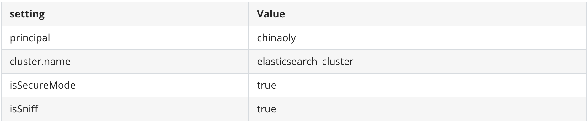

# elasticsearch-bulk-insert

- 本插件只测试了有限的环境，华为elasticsearch集群安全模式（kerberos认证）、版本6.1.3、华为集群版本6.5.0

- 本插件适用于kettle6.1连接华为elasticsearch（6.1.3版本）集群，已测试

- 连接准备 
  1. 在kettle主目录新建conf文件夹
  2. 进入华为elasticsearch集群示例代码中的transport连接方式目录，将conf下es-example.properties文件复制到kettle主目录的conf下
  3. 将kerberos认证的user.keytab文件以及krb5.conf文件复制到kettle主目录的conf下
  
- 华为elasticsearch集群使用kerberos认证，使用transport连接会导致第一次连接比较慢，可能需要几分钟，请耐心等待

- conf目录结构如下

  > ├── es-example.properties
  >
  > ├── krb5.conf
  >
  > └── user.keytab    

  ```properties
  # es-example.properties 文件内容如下，对应配置自行按照现场修改
  cluster.name=elasticsearch_cluster
  esServerHosts=192.168.52.171:24147,192.168.52.171:24101,192.168.52.172:24103,192.168.52.173:24115,192.168.52.174:24119
  principal=chinaoly
  krb5Path=/Users/xiao/Downloads/huawei/
  keytabPath=/Users/xiao/Downloads/huawei/
  isSecureMode=true
  isSniff=true
  
  ```

- 插件在使用过程中测试elasticsearch集群某索引是否存在，不会自动创建索引

- 如果使用上步骤的配置文件，可以在使用插件时不配置setting、服务地址等信息；
  如果不使用配置文件，可在setting中配置如下,但是user.keytab文件以及krb5.conf文件必须放到主目录conf下
  

  | setting      | Value                 |
  | ------------ | --------------------- |
  | principal    | chinaoly              |
  | cluster.name  | elasticsearch_cluster |
  | isSecureMode | true                  |
  | isSniff      | true                  |

> 本文可同样查看README.pdf
  上表看不了，可以看这张截图，或者下载pdf查看
  
